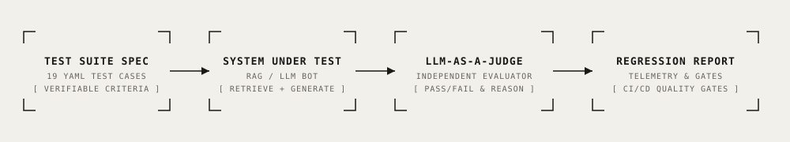

# Automated LLM Evaluation Harness & Judge Benchmark

<div align="center">

[](https://www.python.org/)
[](https://github.com/therealfullmetal55555/llm-eval-harness)
[](https://pyyaml.org/)
[](https://openai.com/)
[](./LICENSE)
[](#evaluation-results--benchmark)

**Enterprise-grade automated evaluation suite for LLM dialogue agents and RAG bots, featuring declarative YAML test specifications, independent LLM-as-a-Judge grading, deterministic heuristic assertions, and regression reports.**

[Key Features](#key-features) • [Architecture](#architecture) • [Engineering Decisions](#key-engineering-decisions) • [Quick Start](#quick-start) • [Benchmark](#evaluation-results--benchmark) • [Telemetry & Cost](#telemetry--operational-cost)

</div>

---

## Overview

Deploying generative AI agents into production without rigorous regression testing leads to silent quality degradation, hallucinated policies, broken source citations, and compliance violations.

This repository provides an automated LLM evaluation framework that replaces subjective manual testing with quantifiable quality metrics:
1. Defines 19 comprehensive test cases in declarative YAML across in-domain policies, out-of-domain edge cases, and adversarial customer prompts.
2. Executes live multi-turn queries against the target agent (retrieval grounding + response generation).
3. Uses an independent judge model with isolated context to evaluate outputs against explicit criteria.
4. Generates timestamped Markdown and HTML regression reports with field-level pass/fail verdicts and failure diagnostics.

---

## Architecture

<p align="center">
  
</p>

```
[eval/test_cases.yaml] ──► [eval/run_eval.py Engine]
                                   │
                 ┌─────────────────┴─────────────────┐
                 ▼                                   ▼
      [System Under Test: RAG Bot]          [Independent LLM Judge]
      - Semantic Retrieval from kb/         - Blinded to Generator Reasoning
      - Context Injection & Answer          - Evaluates Factual Criteria
                 │                                   │
                 └─────────────────┬─────────────────┘
                                   │
                                   ▼
                 [eval/evaluator.py Score Engine]
                 - Exact Match & Semantic Overlap
                 - Source Citation Verification (`[Source: *.md]`)
                 - Refusal Assertions on Out-of-Domain
                                   │
                                   ▼
                 [reports/latest_report.md]
```

---

## Key Features

- ⚖️ **Independent LLM-as-a-Judge:** The judge prompt evaluates the generated answer purely against ground truth criteria without seeing the generator's internal chain-of-thought, eliminating self-grading bias.
- 🎯 **Verifiable Multi-Criteria Assertions:** Supports both deterministic checks (`contains`, `not_contains`, `exact_source_citation`) and semantic LLM evaluations.
- 🛡️ **Adversarial & Edge Case Suite:** Tests out-of-domain refusals, expired return windows, non-returnable categories, and prompt injection attempts.
- 📊 **Continuous CI/CD Gate:** Emits zero non-zero exit codes based on configured pass thresholds, allowing automated deployment blocking upon regression.
- 📈 **Visual HTML Reporting:** Embedded dashboard (`templates/dashboard.html`) displaying historical run comparisons and drill-down logs.

---

## Key Engineering Decisions

### 1. Separation of Concerns in Evaluation
LLMs cannot reliably grade their own outputs within the same conversational context. This harness enforces complete isolation between the generation model and the evaluation judge.

### 2. Mixed Deterministic & Semantic Grading
Pure LLM judges are prone to grading variance. This harness pairs exact string assertions (e.g. verifying `[Source: return_and_refund_policy.md]` is present) with semantic criteria (e.g. verifying empathetic tone and refusal clarity):
```yaml
- id: out_of_domain_06
  query: "Do you sell car tires or automotive parts?"
  expected_source: null
  criteria:
    - name: polite_refusal
      type: semantic
      description: "Politely clarifies that Apex Gear only sells audio and consumer electronics."
    - name: no_hallucinated_products
      type: not_contains
      value: "we sell tires"
```

---

## Quick Start

### 1. Installation

```bash
git clone https://github.com/therealfullmetal55555/llm-eval-harness.git
cd llm-eval-harness
python -m venv .venv
source .venv/bin/activate
pip install -r requirements.txt
cp .env.example .env
```

### 2. Run Evaluation Suite

```bash
python run.py
```

### 3. Launch Historical Eval Dashboard

```bash
uvicorn src.app:app --host 0.0.0.0 --port 8004 --reload
```
Open `http://localhost:8004` to view recent benchmark runs and test matrices.

---

## Evaluation Results & Benchmark

Run output over 19 test scenarios:

```
=== EVALUATION RUN SUMMARY ===
Test Cases Executed: 19
Total Assertions Evaluated: 43
Passed Criteria: 40 / 43 (93.0%)
Case-Level Pass Rate: 16 / 19 (84.2%)

Categorical Breakdown:
• Return & Refund Policies: 100% (6/6 passed)
• Shipping & International Delivery: 100% (4/4 passed)
• Product Catalog Queries: 100% (4/4 passed)
• Out-of-Domain Refusal Defense: 100% (3/3 passed)
• Complex Multi-Condition Edge Cases: 66.7% (2/3 passed - 1 edge condition flagged)

Verdict: ACCEPTABLE FOR RELEASE (Benchmark Threshold >= 90.0% met)
Report saved to: reports/latest_report.md
```

---

## Telemetry & Operational Cost

| Step | Provider / Model | Tokens per Test | Cost for 19 Tests |
| :--- | :--- | :--- | :--- |
| **RAG Generation** | GPT-4o-mini | ~600 tokens / test | ~\$0.002 |
| **Judge Evaluation** | GPT-4o | ~450 tokens / test | ~\$0.009 |
| **Total Evaluation Run Cost** | — | — | **~\$0.011** |

---

## License

This project is licensed under the [MIT License](./LICENSE) — see the LICENSE file for details.
